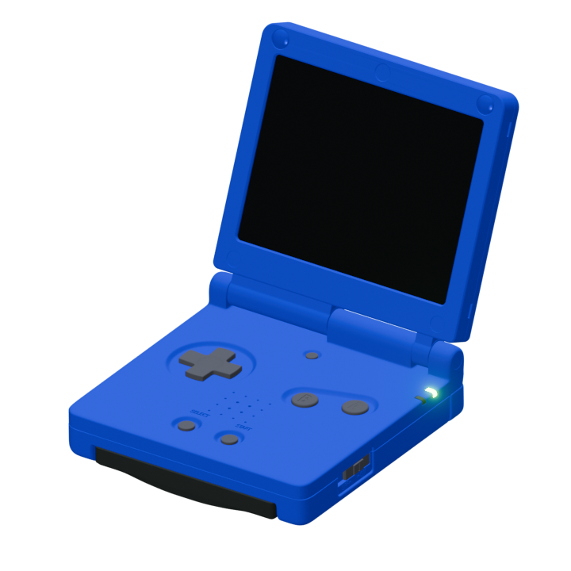

# AC_GBA_Emulator
Game Boy Emulator made by Alex Carter. A passion project and love letter 
to the Game boy series of consoles. 

don't expect it to run great on every computer.


## Build Directions
### Windows
```powershell
cd ./build
cmake .. -G "MinGW Makefiles"
make
```

Uses MinGW to compile, then run `GBA.exe`. 

Roms go in ./build/ROMS/

and Saves will be in ./build/SAVES/

### Linux

requires SDL and SDL_TTF

```bash
cd ./build
cmake ..
make
```

run `./GBA`. 

Roms go in ./build/ROMS/

and Saves will be in ./build/SAVES/





## Credits

### Tinydir

Copyright (c) 2013-2021, tinydir authors:

- Cong Xu

- Lautis Sun

- Baudouin Feildel

- Andargor <andargor@yahoo.com>

All rights reserved.

**see source (`./include/headers/tinydir.h`) for full copyright details**
